.. -*- coding: utf-8 -*-
.. Copyright |copy| 2013 by Benoit Legat
.. Ce fichier est distribué sous une licence `creative commons <http://creativecommons.org/licenses/by-sa/3.0/>`_

Git
---

Introduction
~~~~~~~~~~~~

`Git`_ a été développé initialement pour la gestion du code source du kernel Linux.
Il est aussi utilisé pour la gestion des sources de ce document
depuis https://github.com/obonaventure/SystemesInformatiques.
On l'utilise le plus souvent à l'aide de l'utilitaire `git(1)`_ mais il
existe aussi des
`applications graphiques <http://git-scm.com/downloads/guis>`_.

Les différentes versions sont enregistrées dans des commits qui sont liées
au commit constituant la version précédente.
On sait ainsi facilement voir ce qui a changé entre deux versions
(pas spécialement, une version et la suivante)
et même restaurer l'état de certains fichiers à une version sauvegardée
dans un commit.
Du coup, si vous utilisez `Git`_ pour un projet, vous ne pouvez jamais
perdre plus que les changements que vous n'avez pas encore committé.
Toutes les versions du codes déjà committées sont sauvegardées et facilement
accessibles.
Cette garantie est extrêmement précieuse et constitue à elle seule une raison
suffisante d'utiliser `Git`_ pour tous vos projets.

Contrairement à `subversion`_, il est décentralisé, c'est à dire que chaque
développeur a toute l'information nécessaire pour utiliser `Git`_,
il ne doit pas passer par un serveur où les données sont centralisées à
chaque commande.
Cela prend éventuellement plus d'espace disque mais comme on travaille
avec des documents de type texte, ce n'est pas critique.
Les avantages, par contre, sont nombreux.
On a pas besoin d'être connecté au serveur pour l'utiliser,
il est beaucoup plus rapide
et chaque développeur constitue un backup du code, ce qui est confortable.

De plus, comme on va le voir, `Git`_ supporte une gestion des commits
très flexible avec un historique pas linéaire
mais composés de plusieurs branches et il
permet aux développeurs de ne pas avoir toutes les branches en local.

Cette efficacité de `Git`_ et sa flexibilité sont ses arguments majeurs et
leur origine est évidente quand on sait qu'il a été créé pour gérer des projets
aussi complexes que le kernel Linux.
Il est parfois critiqué pour sa complexité mais c'est surtout dû au fait
qu'il a une façon assez différente de fonctionner des autres.

.. FIXME je dis "historique" ou "arborescence" ? sur le wikipedia
   français, ils disent "arborescence :/ (http://fr.wikipedia.org/wiki/Git)
   Pour svn, historique est le bon terme mais pour Git...
   Je dis "dépôt" ou "repository" ?

Utilisation linéaire de Git
~~~~~~~~~~~~~~~~~~~~~~~~~~~

On peut utiliser `Git`_ à plusieurs niveaux.
On peut tout à fait avoir un historique linéaire tout en profitant pleinement
de `Git`_.
Pour ceux dont c'est la première fois qu'ils utilisent un système de contrôle
de version,
il vaut peut-être mieux commencer par ne lire que cette partie et
déjà l'utiliser de façon plus basique pour le premier projet et
lire les parties suivantes une fois que vous voulez consolider
votre connaissance et apprendre plus en détails comment ça fonctionne
sans toutefois voir toutes ses possibilités.
Toutefois, la lecture de cette partie n'est pas nécessaire pour comprendre
les parties suivantes donc si vous voulez juste parfaire votre
connaissance, vous pouvez la passer sans crainte.

Créer un historique linéaire
############################

Un historique linéaire est un historique comme on l'imagine avec des versions
l'une après l'autre, chaque version étendant la précédente avec
certaines modifications.
On verra par après qu'il est possible d'avoir un historique non-linéaire
avec `Git`_ mais ce n'est pas indispensable.

Sur `Git`_, on appelle une version un *commit*.
Chacun de ces commits est documenté en fournissant le nom de l'auteur,
son email, un commentaire et une description (optionnelle).
Pour ne pas devoir respécifier le nom et l'email à chaque fois,
on le stoque dans le fichier de configuration de `Git`_ ``~/.gitconfig``.
Bien qu'on peut l'éditer manuellement, on préfère le faire à l'aide de
la commande `git-config(1)`_.

Pour spécifier le commentaire,
`git-commit(1)`_ ouvrira un éditeur de texte.
Pour entrer une description, laissez une ligne vide puis écrivez la.
L'éditeur de texte à ouvrir est déterminé par `Git`_ en fonction de la variable
``core.editor`` du fichier de configuration mentionné plus haut.
Vous pouvez aussi spécifier le commentaire à l'aide de l'option ``-m``
de `git-commit(1)`_ comme on verra dans les exemples par après.

Voici les commandes à exécuter pour configurer le nom, l'email et l'éditeur
de texte.
Vous devez bien entendu remplacer les valeurs par celles qui vous conviennent.

.. code-block:: bash

   $ git config --global user.name "Jean Dupont"
   $ git config --global user.email jean@dupont.com
   $ git config --global core.editor gedit

L'option ``--global`` spécifie qu'on veut que ces configurations s'appliquent
pour tous nos dépôts (`Git`_ éditera le fichier ``~/.gitconfig``).
Sinon, `git-config(1)`_ ne modifie que le fichier
``.git/config`` à l'intérieur du *git directory* du projet en cours.
Ce dernier prône bien entendu sur ``~/.gitconfig`` quand une variable
a des valeurs différentes dans ``~/.gitconfig`` et ``.git/config``.

Vous voilà paré pour créer votre premier dépôt `Git`_
mais avant de voir comment faire des nouveaux commits,
il est impératif de comprendre ce qu'est la *staging area*.

Il y a 3 états dans lequel un fichier peut-être,
 - il peut être dans le *working directory*,
   c'est à dire que c'est le fichier tel qu'il est actuellement dans le code;
 - il peut être dans la *staging area*,
   c'est à dire que ses changements seront pris en compte dans le prochain
   commit;
 - et il peut être dans le *git directory*, c'est à dire sauvegardé dans
   un commit à l'intérieur du dossier ``.git``.

Pour committer des changements, on les mets d'abord dans la
*staging area* puis on commit.
Cette flexibilité permet de ne pas committer
tout les changements du *working directory*.

Voyons tout ça avec un programme exemple qui affiche en LaTex
la somme des entiers de :math:`1` à :math:`n`.
On va utiliser les commandes

 * `git-init(1)`_ qui permet de transformer un projet en dépôt `Git`_
   (tout est stoqué dans le dossier ``.git``);
 * `git-diff(1)`_ qui donne la différence entre l'état des fichiers dans le
   *working directory* avec leur état dans le *git directory*
   au commit actuel;
 * `git-status(1)`_ qui affiche les fichiers modifiés et ceux qui vont être
   commités;
 * `git-add(1)`_ qui spécifie quels fichiers doivent faire partie du prochain
   commit en les ajoutant à la *staging area*;
 * `git-commit(1)`_ qui commit les fichiers dans la *staging area*;
 * et `git-log(1)`_ qui montre tous les commits de l'historique.

La première version sera la suivante

.. code-block:: c

   #include <stdio.h>
   #include <stdlib.h>

   int main (int argc, char *argv[]) {
     long int sum = 0, i, n = 42;
     for (i = 1; i <= n; i++) {
       sum += i;
     }
     printf("\\sum_{i=1}^{%ld} i = %ld\n", n, sum);
     return EXIT_SUCCESS;
   }

Ce programme fonctionne comme suit

.. code-block:: bash

   $ gcc main.c
   $ ./a.out
   \sum_{i=1}^{42} i = 903

On va sauvegarder un premier commit contenant cette version de ``main.c``

`git-init(1)`_ permet d'initialiser le dépôt `Git`_.
`git-status(1)`_ analyse le contenu du répertoire.
Il indique que le fichier ``main.c`` n'est pas suivi par `Git`_ (`untracked`).
Ce fichier est ajouté avec la commande `git-add(1)`_.
`git-commit(1)`_ sauvegarde cette version du code dans un commit
dont le commentaire, spécifié avec l'option ``-m``, est *First commit*.

.. code-block:: bash

   $ git init
   Initialized empty Git repository in /path/to/project/.git/
   $ git status
   # On branch master
   #
   # Initial commit
   #
   # Untracked files:
   #   (use "git add <file>..." to include in what will be committed)
   #
   #	main.c
   nothing added to commit but untracked files present (use "git add" to track)
   $ git add main.c
   $ git status
   # On branch master
   #
   # Initial commit
   #
   # Changes to be committed:
   #   (use "git rm --cached <file>..." to unstage)
   #
   #	new file:   main.c
   #
   $ git commit -m "First commit"
   [master (root-commit) 3d18efe] First commit
    1 file changed, 11 insertions(+)
    create mode 100644 main.c
   $ git log
   commit 3d18efe4df441ebe7eb2b8d0b78832a3861dc05f
   Author: Benoît Legat <benoit.legat@gmail.com>
   Date:   Sun Aug 25 15:32:42 2013 +0200

       First commit

Modifions maintenant le programme pour qu'il prenne la valeur de
:math:`n` dans ``argv``.
Si on compile le programme après modification, et qu'on exécute avec
en argument :math:`10` puis :math:`9.75`, on obtient ce qui suit

.. code-block:: bash

   $ gcc main.c
   $ ./a.out 10
   \sum_{i=1}^{10} i = 55
   $ ./a.out 9.75
   $ echo $?
   1

On peut maintenant voir avec `git-status(1)`_ que le fichier ``main.c``
a été modifié

.. code-block:: bash

   $ git status
   # On branch master
   # Changes not staged for commit:
   #   (use "git add <file>..." to update what will be committed)
   #   (use "git checkout -- <file>..." to discard changes in working directory)
   #
   #	modified:   main.c
   #
   no changes added to commit (use "git add" and/or "git commit -a")

Avec `git-diff(1)`_, on peut voir quelles sont les lignes qui ont été
retirées (elles commencent par un ``-``) et celles qui ont été ajoutées
(elles commencent par un ``+``).

.. code-block:: diff

   $ git diff
   diff --git a/main.c b/main.c
   index 86601ed..a9e4c4a 100644
   --- a/main.c
   +++ b/main.c
   @@ -2,7 +2,12 @@
    #include <stdlib.h>

    int main (int argc, char *argv[]) {
   -  long int sum = 0, i, n = 42;
   +  long int sum = 0, i, n;
   +  char *end = NULL;
   +  n = strtol(argv[1], &end, 10);
   +  if (*end != '\0') {
   +    return EXIT_FAILURE;
   +  }
      for (i = 1; i <= n; i++) {
        sum += i;
      }

Ajoutons ``main.c`` aux modifications à mettre dans le prochain commit puis
créons ce commit

.. code-block:: bash

   $ git add main.c
   $ git commit -m "Read n from argv"
   [master 56ce59c] Read n from argv
    1 file changed, 6 insertions(+), 1 deletion(-)

On peut maintenant voir le nouveau commit dans l'historique affiché par
`git-log(1)`_

.. code-block:: bash

   $ git log
   commit 56ce59c54726399c18b3f87ee23a45cf0d7f015d
   Author: Benoît Legat <benoit.legat@gmail.com>
   Date:   Sun Aug 25 15:37:51 2013 +0200

       Read n from argv

   commit 3d18efe4df441ebe7eb2b8d0b78832a3861dc05f
   Author: Benoît Legat <benoit.legat@gmail.com>
   Date:   Sun Aug 25 15:32:42 2013 +0200

       First commit

On va maintenant s'occuper d'un *segmentation fault* qui arrive
quand il n'y a pas d'argument.

.. code-block:: bash

   $ gcc main.c
   $ ./a.out
   Segmentation fault (core dumped)

Pour cela, on va simplement vérifier la valeur de ``argc`` et utiliser :math:`42` comme
valeur par défaut.
`git-diff(1)`_ nous permet de voir les changements qu'on a fait

.. code-block:: diff

   $ git diff
   diff --git a/main.c b/main.c
   index a9e4c4a..e906ea1 100644
   --- a/main.c
   +++ b/main.c
   @@ -2,11 +2,13 @@
    #include <stdlib.h>

    int main (int argc, char *argv[]) {
   -  long int sum = 0, i, n;
   +  long int sum = 0, i, n = 42;
      char *end = NULL;
   -  n = strtol(argv[1], &end, 10);
   -  if (*end != '\0') {
   -    return EXIT_FAILURE;
   +  if (argc > 1) {
   +    n = strtol(argv[1], &end, 10);
   +    if (*end != '\0') {
   +      return EXIT_FAILURE;
   +    }
      }
      for (i = 1; i <= n; i++) {
        sum += i;

On va maintenant committer ces changement
dans un commit au commentaire *Fix SIGSEV*

.. code-block:: bash

   $ git add main.c
   $ git commit -m "Fix SIGSEV"
   [master 7a26c63] Fix SIGSEV
    1 file changed, 6 insertions(+), 4 deletions(-)
   $ git log
   commit 7a26c6338c38614ce1c4ff00ac0a6895b57f15cb
   Author: Benoît Legat <benoit.legat@gmail.com>
   Date:   Sun Aug 25 15:39:49 2013 +0200

       Fix SIGSEV

   commit 56ce59c54726399c18b3f87ee23a45cf0d7f015d
   Author: Benoît Legat <benoit.legat@gmail.com>
   Date:   Sun Aug 25 15:37:51 2013 +0200

       Read n from argv

   commit 3d18efe4df441ebe7eb2b8d0b78832a3861dc05f
   Author: Benoît Legat <benoit.legat@gmail.com>
   Date:   Sun Aug 25 15:32:42 2013 +0200

       First commit

Travailler à plusieurs sur un même projet
#########################################

`Git`_ est déjà un outil très pratique à utiliser seul mais c'est quand
on l'utilise pour se partager du code qu'il devient vraiment indispensable.
On se partage le code par l'intermédiaire de *remotes*.
Ce sont en pratique des serveurs auxquels on peut avoir l'accès lecture et/ou
écriture.
On va traiter ici le cas où deux développeurs, Alice et Bob,
ont l'accès lecture et écriture.

Alice va créer le projet avec

.. code-block:: bash

   $ git init
   Initialized empty Git repository in /path/to/project/.git/

puis elle créera une *remote*, c'est à dire un autre dépôt `Git`_ que celui
qu'ils ont en local, avec lequel ils vont pouvoir synchroniser leur
historique.
Supposons qu'ils aient un projet *projectname* sur Github.
Vous pouvez créer le *remote* comme suit

.. code-block:: bash

   $ git remote add https://github.com/alice/projectname.git

Ensuite, vous pourrez obtenir les modifications de l'historique du *remote*
avec ``git pull origin master``
et ajouter vos modifications avec ``git push origin master``.

Si vous exécutez ``git pull origin master``, que vous faites quelques
commits et puis que vous essayer de mettre *origin* à jour avec
``git push origin master``,
il faut qu'aucun autre développeur n'ait pushé de modification entre temps.
S'il en a pushé, `Git`_ ne saura pas effectuer votre *push*.
Il vous faudra alors faire un *pull*.
`Git`_ tentera alors de fusionner vos changements avec ceux d'*origin*.
Si ces derniers sont à une même ligne d'un même fichier, il vous demandera
de résoudre le conflit vous-même.
Il est important pour cela que vous ayez commité vos changements avant
le *pull* sinon `Git`_ l'abandonnera car il ne sait que fusionner des commits.
C'est à dire que ce qu'il y a dans le *git directory*,
pas ce qu'il y a dans le *working directory* ni dans la *staging area*.

Prenons un exemple où Bob *push* en premier puis Alice doit résoudre
un conflit.
Alice commence avec le fichier ``main.c`` suivant

.. code-block:: c

   #include <stdio.h>
   #include <stdlib.h>

   int main (int argc, char *argv[]) {
   }

Elle fait le premier commit du projet

.. code-block:: bash

   $ git add main.c
   $ git commit -m "Initial commit"
   [master (root-commit) 80507e3] Initial commit
    1 file changed, 5 insertions(+)
    create mode 100644 main.c

et va maintenant le *pusher* sur le serveur

.. code-block:: bash

   $ git push origin master
   Counting objects: 3, done.
   Delta compression using up to 4 threads.
   Compressing objects: 100% (2/2), done.
   Writing objects: 100% (3/3), 282 bytes, done.
   Total 3 (delta 0), reused 0 (delta 0)
   To https://github.com/alice/projectname.git
   * [new branch]      master -> master

Bob clone alors le projet pour en avoir une copie en local
ainsi que tout l'historique et la remote *origin* déjà configurée

.. code-block:: bash

   $ git clone https://github.com/alice/projectname.git
   Cloning into 'projectname'...
   remote: Counting objects: 3, done.
   remote: Compressing objects: 100% (2/2), done.
   remote: Total 3 (delta 0), reused 3 (delta 0)
   Unpacking objects: 100% (3/3), done.
   $ git remote -v
   origin	https://github.com/alice/projectname.git (fetch)
   origin	https://github.com/alice/projectname.git (push)

Ensuite, il ajoute ses modifications

.. code-block:: diff

   $ git diff
   diff --git a/main.c b/main.c
   index bf17640..0b0672a 100644
   --- a/main.c
   +++ b/main.c
   @@ -2,4 +2,5 @@
    #include <stdlib.h>

    int main (int argc, char *argv[]) {
   +  return 0;
    }

et les commit

.. code-block:: bash

   $ git add main.c
   $ git commit -m "Add a return statement"
   [master 205842a] Add a return statement
    1 file changed, 1 insertion(+)

et les push sur le serveur

.. code-block:: bash

   $ git push origin master
   Counting objects: 5, done.
   Delta compression using up to 4 threads.
   Compressing objects: 100% (2/2), done.
   Writing objects: 100% (3/3), 291 bytes, done.
   Total 3 (delta 1), reused 0 (delta 0)
   To https://github.com/alice/projectname.git
      80507e3..205842a  master -> master

Pendant ce temps là, Alice ne se doute de rien et
fait ses propres modifications

.. code-block:: diff

   $ git diff
   diff --git a/main.c b/main.c
   index bf17640..407cd8a 100644
   --- a/main.c
   +++ b/main.c
   @@ -2,4 +2,5 @@
    #include <stdlib.h>

    int main (int argc, char *argv[]) {
   +  return EXIT_SUCCESS;
    }

puis les commit

.. code-block:: bash

   $ git add main.c
   $ git commit -m "Add missing return statement"
   [master 73c6a3a] Add missing return statement
    1 file changed, 1 insertion(+)

puis essaie de les pusher

.. code-block:: bash

   $ git push origin master
   To https://github.com/alice/projectname.git
    ! [rejected]        master -> master (non-fast-forward)
   error: failed to push some refs to 'https://github.com/alice/projectname.git'
   hint: Updates were rejected because the tip of your current branch is behind
   hint: its remote counterpart. Merge the remote changes (e.g. 'git pull')
   hint: before pushing again.
   hint: See the 'Note about fast-forwards' in 'git push --help' for details.

mais `Git`_ lui fait bien comprendre que ce n'est pas possible.
En faisant le *pull*, on voit que `Git`_ fait de son mieux pour
fusionner les changements mais qu'il préfère nous laisser
choisir quelle ligne est la bonne

.. code-block:: bash

   $ git pull origin master
   remote: Counting objects: 5, done.
   remote: Compressing objects: 100% (1/1), done.
   remote: Total 3 (delta 1), reused 3 (delta 1)
   Unpacking objects: 100% (3/3), done.
   From https://github.com/alice/projectname
      80507e3..205842a  master     -> origin/master
   Auto-merging main.c
   CONFLICT (content): Merge conflict in main.c
   Automatic merge failed; fix conflicts and then commit the result.

Il marque dans ``main.c`` la ligne en conflit et ce qu'elle vaut
dans les deux commits

.. code-block:: c

   #include <stdio.h>
   #include <stdlib.h>

   int main (int argc, char *argv[]) {
   <<<<<<< HEAD
     return EXIT_SUCCESS;
   =======
     return 0;
   >>>>>>> 205842aa400e4b95413ff0ed21cfb1b090a9ef28
   }

On peut retrouver les fichiers en conflits dans
``Unmerged paths``

.. code-block:: bash

   $ git status
   # On branch master
   # You have unmerged paths.
   #   (fix conflicts and run "git commit")
   #
   # Unmerged paths:
   #   (use "git add <file>..." to mark resolution)
   #
   #	both modified:      main.c
   #
   no changes added to commit (use "git add" and/or "git commit -a")

Il nous suffit alors d'éditer le fichier pour lui donner le contenu
de la fusion

.. code-block:: c

   #include <stdio.h>
   #include <stdlib.h>

   int main (int argc, char *argv[]) {
     return EXIT_SUCCESS;
   }

puis de le committer

.. code-block:: bash

   $ git add main.c
   $ git commit
   [master eede1c8] Merge branch 'master' of https://github.com/alice/projectname

On peut alors mettre le serveur à jour

.. code-block:: bash

   $ git push origin master
   Counting objects: 8, done.
   Delta compression using up to 4 threads.
   Compressing objects: 100% (3/3), done.
   Writing objects: 100% (4/4), 478 bytes, done.
   Total 4 (delta 2), reused 0 (delta 0)
   To https://github.com/alice/projectname.git
      205842a..eede1c8  master -> master

Paul peut alors récupérer les changements avec

.. code-block:: bash

   $ git pull origin master
   remote: Counting objects: 8, done.
   remote: Compressing objects: 100% (1/1), done.
   remote: Total 4 (delta 2), reused 4 (delta 2)
   Unpacking objects: 100% (4/4), done.
   From https://github.com/alice/projectname
      205842a..eede1c8  master     -> origin/master
   Updating 205842a..eede1c8
   Fast-forward
    main.c | 2 +-
    1 file changed, 1 insertion(+), 1 deletion(-)

La plupart des fusions ne demande pas d'intervention manuelle mais
dans les cas comme celui-ci,
`Git`_ n'a pas d'autre choix que de nous demander notre avis.

Contribuer au syllabus
######################

Dans le cas du syllabus, vous n'avez pas l'accès écriture.
La manière dont Github fonctionne pour règler ça c'est que vous *forkez* le
projet principal.
C'est à dire que vous en faites un copie indépendante à votre nom.
À celle là vous avez l'accès écriture.
Vous allez ensuite soumettre vos changements sur celle là puis les
proposer à travers l'interface de Github qu'on appelle *Pull request*.
Conventionnellement, on appelle la *remote* du dépôt principal *upstream*
et la votre *origin*.

Commencez donc par vous connecter sur Github, allez à
l'`adresse du code du syllabus
<https://github.com/obonaventure/SystemesInformatiques/>`_ et cliquez
sur *Fork*.

Vous pouvez maintenant obtenir le code du syllabus avec la commande
`git-clone(1)`_
(remplacez ``username`` par votre nom d'utilisateur sur Github)

.. code-block:: bash

   $ git clone https://github.com/username/SystemesInformatiques.git

Vous pouvez alors faire les changements que vous désirez puis les committer
comme expliqué à la section précédente.
Il est utile de garder le code à jour avec *upstream*.
Pour cela, il faut commencer par ajouter la remote

.. code-block:: bash

   $ git remote add upstream https://github.com/obonaventure/SystemesInformatiques.git

À chaque fois que vous voudrez vous mettre à jour, utilisez `git-pull(1)`_

.. code-block:: bash

   $ git pull upstream master

Une fois vos changements commités, vous pouvez les ajouter à *origin* avec
`git-push(1)`_

.. code-block:: bash

   $ git push origin master

Votre amélioration devrait normalement être visible via
`https://github.com/obonaventure/SystemesInformatiques/network <https://github.com/obonaventure/SystemesInformatiques/network>`_.
Vous pouvez maintenant aller sur Github à la page de votre fork et
cliquer sur *Pull Requests* puis *New pull request* et expliquer
vos changements.

Si plus tard vous voulez encore modifier le syllabus,
il vous suffira de mettre à jour le code en local

.. code-block:: bash

   $ git pull upstream master

committer vos changements, les ajouter à *origin*

.. code-block:: bash

   $ git push origin master

puis faire un nouveau pull request.

Utilisation non-linéaire de Git
~~~~~~~~~~~~~~~~~~~~~~~~~~~~~~~

`Git`_ peut créer un historique non-linéaire semblable à celui ci-dessous.
C'est un exemple un peu exagéré de non-linéarité mais il est
pédagogiquement intéressant.

Cet historique forme un graphe orienté,
c'est à dire que les arêtes ont une direction.

Les noeuds sont de 3 types,
 - en bleu, on a les commits, c'est comme un snapshot, c'est une
   description complète de l'état de tous les fichiers pris en
   charge par `Git`_ à un moment donné.
   Ces commits sont

    - soit construits comme la version suivante d'un autre commit
      dans lequel cas il y a une seul arête partant du noeud,
    - soit construits comme la fusion de deux commits
      dans lequel cas il y a deux arêtes partant du noeud.

   Ils sont référés par un hash unique dont le début est affiché
   sur la première ligne dans l'image ci-dessous
   et non par un nombre
   comme pour beaucoup d'autres systèmes de gestion de code
   partagé.
   Ils ont aussi un commentaire qui est affiché sur la deuxième ligne,
   une description (optionnelle), un auteur et une date;
 - en rouge, on a les branches, le nom est un peu trompeur car
   c'est juste un pointeur vers un commit.
   On pourrait tout à fait avoir un graphe non-linéaire sans
   utiliser de branches,
   c'est juste plus facile de référer les commits par le nom
   d'une branche qui y réfère plutôt que par un hash sans signification;
 - en vert, ce sont les tags, un tag est comme une branche qui
   ne bouge pas, c'est à dire qu'il réfère toujours vers le même
   commit.
   C'est utile par exemple pour spécifier des versions d'un projet.
 - en jaune, on a ``HEAD``, c'est un pointeur vers la branche active.

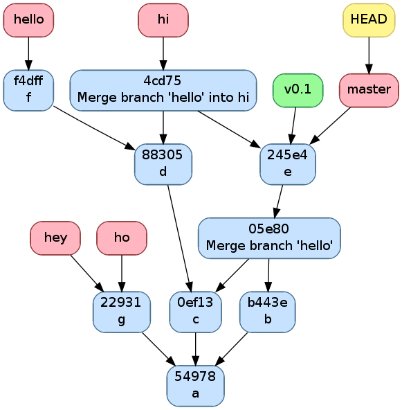

   Exemple d'historique.

Manipulation de l'historique à travers les commandes Git
~~~~~~~~~~~~~~~~~~~~~~~~~~~~~~~~~~~~~~~~~~~~~~~~~~~~~~~~

Pour initialiser un dépôt `Git`_,
il suffit d'utiliser la commande `git-init(1)`_

.. code-block:: bash

   $ git init
   Initialized empty Git repository in /path/to/project/.git/

À ce moment, l'historique est vide.

Staging area
############

Commençons par définir les 4 statuts qu'un fichier peut avoir
 - il peut être non-traqué par `Git`_, c'est à dire qu'il n'est
   ni dans le *git directory*, ni dans la *staging area*.
   C'est un fichier que le autres développeurs peuvent ne même pas être
   au courant que vous l'avez dans votre *working directory*.
   C'est souvent le cas des fichiers qui sont générés automatiquement,
   et dont leur changement n'a donc aucun intérêt à être suivit.
   Dans le cas d'un projet en C,
   on aura les fichiers résultant de la compilation comme les fichiers objets
   ``*.o``;
 - il peut être non-modifié, c'est à dire que son état dans le
   *working directory* est le même que celui dans le *git directory* au
   commit actif (référencé par la branche active,
   celle référencée par ``HEAD``) ainsi que celui dans la *staging area*
   s'il y est;
 - il peut être modifié, c'est à dire que sont état est différent dans le
   *working directory* que celui dans le *git directory* au commit actif
   ainsi que celui dans la *staging area* si il y est.
 - il peut être *staged*, c'est à dire qu'il est dans la *staging area*

Par exemple, prenons un fichier non-modifié.
Après des modifications, il a le statut modifié.
Si on le place dans la *staging area*, il acquière le statut *staged*.
Si on le modifie à nouveau, il aura le statut modifié mais
son état avec uniquement les premières modifications aura le statut *staged*.

Pour obtenir l'information sur le statut de tous les fichiers,
utilisez `git-status(1)`_

.. code-block:: bash

   $ git status
   # On branch master
   # Changes to be committed:
   #   (use "git reset HEAD <file>..." to unstage)
   #
   #	modified:   main.c
   #	new file:   file.c
   #
   # Changes not staged for commit:
   #   (use "git add <file>..." to update what will be committed)
   #   (use "git checkout -- <file>..." to discard changes in working directory)
   #
   #    modified:   main.c
   #	modified:   Makefile
   #
   # Untracked files:
   #   (use "git add <file>..." to include in what will be committed)
   #
   #	main.o
   #	file.o
   #	a.out

Dans la partie ``Changes to be committed``,
on a les fichiers au statut *staged*.
Dans la partie ``Changes not staged for commit``,
on a les fichiers au statut modifié.
Les fichiers au statut non-modifié ne sont pas affichés et ceux non-trackés
sont dans la partie ``Untracked files`` sauf si on a spécifiquement demandé
de les ignorer dans le fichier ``.gitignore``.
En effet, on peut s'imaginer que dans un gros projet, la partie
``Untracked files`` peut devenir assez imposante et on ne sait plus
distinguer les fichiers qu'il faut penser à ajouter de ceux qu'il faut
ignorer une fois de plus.

Lorsque `Git`_ voit un fichier ``.gitignore`` dans un dossier,
il en prend compte pour tous ses fichiers ainsi que tous les fichiers des
sous-dossiers.
La syntaxe est très simple, on spécifie un fichier par ligne,
on utilise un ``*`` pour spécifier n'importe
quelle chaine de charactères, les commentaires commencent par un ``#``
comme en Bash et si la ligne commence par un ``!``,
on demande de ne pas ignorer ce fichier à l'intérieur du dossier même
si un ``.gitignore`` d'un dossier parent dit le contraire.
Dans notre exemple, ``.gitignore`` aura le contenu suivant

.. code-block:: bash

   # Object files
   *.o
   # Executable
   a.out

Pour faire passer un fichier du statut modifié au status *staged*,
il faut utiliser `git-add(1)`_.
Lorsqu'on lui donne en argument un fichier modifié, elle ajoute sa version
avec toutes les modifications dans la *staging area*.
Si on lui donne un dossier,
elle ajoute tous les fichiers au statut modifié ou
au statut non-traqué qui ne sont pas ignoré par `Git`_.

.. code-block:: bash

   $ git add .

On peut aussi donner l'option ``-p`` à `git-add(1)`_,
`Git`_ demandera alors pour chaque bloc de modification s'il faut le prendre
en compte puis ajoutera dans la *staging area* un fichier avec toutes
ces modifications.
C'est très utile si on a fait différents changements dans un fichier mais
qu'on ne veut pas tout committer ou qu'on veut les séparer en différents
commits parce qu'ils font des choses différentes.
Par exemple, si j'ai un fichier ``main.c`` dans lequel j'ai rajouté
un ``return EXIT_SUCCESS;`` et un commentaire en début de fichier
mais que je n'ai envie que de faire passer le ``return EXIT_SUCCESS;``
dans la *staging area*, il me suffit de faire

.. code-block:: diff

   $ git add -p main.c
   diff --git a/main.c b/main.c
   index 7402a78..8381ce0 100644
   --- a/main.c
   +++ b/main.c
   @@ -1,3 +1,7 @@
   +/*
   + * Print 'Hello world!'
   + */
   +
    // includes
    #include <stdio.h>
    #include <stdlib.h>
   Stage this hunk [y,n,q,a,d,/,j,J,g,e,?]? n
   @@ -5,4 +9,5 @@
    // main function
    int main () {
      printf("Hello world!\n");
   +  return EXIT_SUCCESS;
    }
   Stage this hunk [y,n,q,a,d,/,K,g,e,?]? y

On peut aussi faire retirer des fichier de la *staging area* avec la commande
`git-reset(1)`_.
``git reset`` les retire tous,
``git reset main.c`` retire uniquement ``main.c`` et on a à nouveau
l'option ``-p`` pour ne sélectionner qu'une partie.
Par exemple, si dans l'exemple précédent j'avais mis ``main.c`` entièrement
dans la *staging area* mais que je veux comme précédemment uniquement
mettre le ``return EXIT_SUCCESS;``, je peux soit faire ``git reset main.c``
et puis faire ``git add -p main.c`` comme tout à l'heure, soit faire

.. code-block:: diff

   $ git reset -p main.c
   diff --git a/main.c b/main.c
   index 7402a78..8381ce0 100644
   --- a/main.c
   +++ b/main.c
   @@ -1,3 +1,7 @@
   +/*
   + * Print 'Hello world!'
   + */
   +
    // includes
    #include <stdio.h>
    #include <stdlib.h>
   Unstage this hunk [y,n,q,a,d,/,j,J,g,e,?]? y
   @@ -5,4 +9,5 @@
    // main function
    int main () {
      printf("Hello world!\n");
   +  return EXIT_SUCCESS;
    }
   Unstage this hunk [y,n,q,a,d,/,K,g,e,?]? n

Avant d'utiliser `git-add(1)`_ et `git-reset(1)`_,
il est utile de vérifier plus précisément ce qu'on a changé dans
les fichiers que `git-status(1)`_ nous dit qu'on a modifié.
C'est une des utilités de la commande `git-diff(1)`_.
Par défaut, elle calcule les changements entre le *working directory*
et la *staging area*, mais on peut aussi lui demander de regarder les
changements entre deux commits.
Si on ne lui dit rien, elle donne les changements de tous les fichiers mais
on peut lui demander de se limiter à un fichier ou à un dossier spécifique.
Dans notre exemple,

.. code-block:: diff

   $ git diff main.c
   diff --git a/main.c b/main.c
   index 07e26bf..8381ce0 100644
   --- a/main.c
   +++ b/main.c
   @@ -1,3 +1,7 @@
   +/*
   + * Print 'Hello world!'
   + */
   +
    // includes
    #include <stdio.h>
    #include <stdlib.h>

On peut aussi lui demander de générer un patch,
c'est à dire un fichier qui contient les informations nécessaires pour
appliquer ce changement chez un autre développeur.
Ce n'est pas la manière la plus pratique de se partager les changements
comme on verra avec les *remotes* mais c'est utilisé.

Commit
######

Voyons à présent comment committer
les fichiers présents dans la *staging area*.
Comme vu précédemment,
il y a toujours un commit actif,
c'est comparativement à ce dernier que `Git`_ détermine si un fichier est
modifié ou pas.

Lorqu'on choisit de committer ce qu'il y a dans la *staging area*,
un nouveau commit est créé avec le même état que le précédent plus les
modifications des fichiers au statut *staged*.
Ce nouveau commit a une référence vers le commit précédent.
La branche active change alors de référence et pointe alors vers le nouveau
commit.
Aucune autre branche ne bouge, même celle qui référençait l'ancien commit.
On peut retenir qu'*il n'y a toujours que la branche active qui est modifée*.

Dans notre exemple,
l'historique était comme l'image ci-dessous

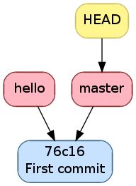

   Historique avant le commit

.. code-block:: bash

   $ git commit -m "Add return"
   [master 6e2f599] Add return
    1 file changed, 1 insertion(+)

Après le commit, il est comme l'image ci-dessous.
On voit que la branche active a avancé alors que les autres n'ont pas bougé.

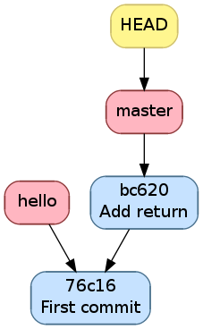

   Historique après le commit

Lorsqu'on fait ``gcc main.c`` un fichier ``a.out`` est généré.
Il est inutile de suivre ses changements à travers `Git`_ car ses modifications
ne sont que l'image des modifications de ``main.c``.
De plus, ce n'est pas un fichier texte donc `Git`_ ne verra pas ce qui
a changé, il fera comme si tout ``a.out`` avait changé.

.. code-block:: bash

   $ echo "a.out" > .gitignore
   $ git status
   # On branch master
   # Changes not staged for commit:
   #   (use "git add <file>..." to update what will be committed)
   #   (use "git checkout -- <file>..." to discard changes in working directory)
   #
   #	modified:   main.c
   #
   # Untracked files:
   #   (use "git add <file>..." to include in what will be committed)
   #
   #	.gitignore
   no changes added to commit (use "git add" and/or "git commit -a")
   $ git add .gitignore
   $ git commit -m "Add .gitignore"
   [master b14855e] Add .gitignore
    1 file changed, 1 insertion(+)
    create mode 100644 .gitignore

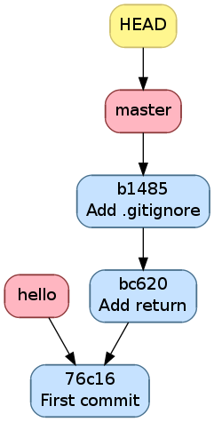

   Historique l'ajout de .gitignore

Souvent, on a envie de committer tous les fichiers au statut *modifié*.
Si on fait ``git add .``, on ajoutera aussi tous les fichiers non-traqués
qui ne sont pas ignorés, c'est à dire ceux affichés par ``git status``
en dessous de ``Untracked files``.
Si ça pose problème, on peut utiliser l'option ``-a`` de `git-commit(1)`_
qui inclut tous les fichiers au statut *modifié* en plus de ceux dans la
*staging area* pour le commit.
On verra des exemples d'utilisation par après.

Branching
~~~~~~~~~

Lorsqu'on exécute ``git init``, une branche au nom de ``master`` est créée.
Beaucoup de petits projets se contentent de cette branche et n'en font pas
d'autre mais c'est passer à côté d'un des aspects les plus pratiques de `Git`_.

Une utilisation classique des branches sont les *feature branches*.
C'est à dire qu'on a la branche principale ``master`` qui contient un code
de toutes les fonctionnalités terminées.
Quand on essaie d'ajouter une
fonctionnalité (*feature* en anglais), on crée une nouvelle branche qu'on
ne fusionne avec ``master`` que lorsque le code est terminé.
Ça permet de pouvoir implémenter plusieurs fonctionnalités en parallèle sans
être gêné par l'instabilité du code créé par les fonctionnalités
en développement.
Ceci est encore plus vrai quand on travaille à plusieurs sur un même code
et sur les même fonctionnalités.

Par exemple, supposons que vous soyez à 2 à travailler sur un projet.
L'un travaille sur une fonctionnalité, l'autre sur une autre.
À la base, le code sans ces deux fonctionnalités marchait mais comme
vous êtes en train d'en implémenter une nouvelle chacun, le code ne marche
chez aucun des deux développeurs.

Créer une branche
#################

Pour créer une branche, on utilise la commande `git-branch(1)`_.
`git-branch(1)`_ sert aussi à montrer la liste des branches avec
le caractère ``*`` devant la branche active.

Par exemple, supposons qu'on veuille ajouter à notre exemple la possibilité
de changer le message un caractère plus universel pour que le programme soit
utilisable pour tout citoyen de l'univers.
Mais qu'on veut aussi ajouter un aspect pratique en rajoutant le pid
du processus et du processus parent.

On commencera par créer deux *feature branches*, ``pid`` et ``universal``.
On supprime la branche ``hello`` qui servait juste à montrer qu'elle ne bougeait
pas quand on committait car ce n'était pas la branche active.

.. code-block:: bash

   $ git branch
     hello
   * master
   $ git branch pid
   $ git branch universal
   $ git branch -d hello
   Deleted branch hello (was 76c1677).
   $ git branch
   * master
     pid
     universal

L'historique ressemble maintenant à la figure suivante.
On voit que `git-branch(1)`_ ne modifie pas la branche active.

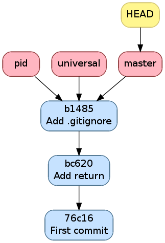

   Historique après la création de ``pid`` et ``universal`` et
   la suppression de ``hello``

On va d'ailleurs finalement committer notre commentaire en début de fichier
dans ``master``. On obtient alors la figure suivante

.. code-block:: bash

   $ git s
   # On branch master
   # Changes not staged for commit:
   #   (use "git add <file>..." to update what will be committed)
   #   (use "git checkout -- <file>..." to discard changes in working directory)
   #
   #	modified:   main.c
   #
   no changes added to commit (use "git add" and/or "git commit -a")
   $ git commit -a -m "Add intro"
   [master c1f2163] Add intro
    1 file changed, 4 insertions(+)

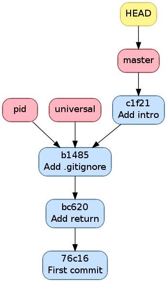

   Historique après avoir ajouté un commentaire d'introduction

Changer la branche active
#########################

On va maintenant voir comment changer la branche active,
c'est à dire la branche vers laquelle ``HEAD`` pointe.
Pour faire cela, on utilise `git-checkout(1)`_.

.. code-block:: bash

   $ git checkout pid
   Switched to branch 'pid'
   $ git branch
     master
   * pid
     universal

`git-checkout(1)`_ ne fait pas que changer la branche active, il modifie
aussi le *working directory* pour refléter le commit référencé par la nouvelle
branche active.
Après le *checkout*, le contenu de ``main.c`` vaut

.. code-block:: c

   // includes
   #include <stdio.h>
   #include <stdlib.h>

   // main function
   int main () {
     printf("Hello world!\n");
     return EXIT_SUCCESS;
   }

S'il y a des fichiers modifiés au moment du `git-checkout(1)`_,
`Git`_ va faire du mieux qu'il peut pour changer de branche en gardant
vos modifications mais si le fichier modifié est justement un fichier
qui diffère entre l'ancienne branche active et la nouvelle branche active,
`Git`_ va abandonner le changement de branche car mettre ce fichier à
la version de la nouvelle branche écraserait les modifications.

Les changements doivent alors soit être committés,
soit sauvegardés par `git-stash(1)`_ (détailllé plus loin),
soit abandonnés.
Pour abandonner des changements et revenir à la version du commit référencé
par la branche active, on utilise aussi `git-checkout(1)`_.
Avec `Git`_, pas mal de commandes ont de multiples usages.

Dans notre exemple, si on change ``main.c``, cela pose problème car il
diffère entre ``master`` et ``pid`` mais
si on change ``.gitignore``, ça n'en pose pas.
Il nous montre d'ailleurs que ``.gitignore`` a des modifications et qu'il
les a laissées lorsqu'on exécute ``git checkout master``

.. code-block:: bash

   $ echo "42" >> main.c
   $ echo "42" >> .gitignore
   $ git checkout master
   error: Your local changes to the following files would be overwritten by checkout:
       main.c
   Please, commit your changes or stash them before you can switch branches.
   Aborting
   $ git checkout main.c
   $ git checkout master
   M	.gitignore
   Switched to branch 'master'
   $ git checkout .gitignore # Retirons ce "42", c'était juste pour l'exemple

Fusionner des branches
######################

Lorsqu'on fusionne deux branches,
le rôle de chaque branche n'est pas le même.
Il y a la branche active et la branche qu'on veut fusionner.
Par la règle *il n'y a toujours que la branche active qui est modifée*,
on sait que la branche qu'on veut fusionner ne va pas bouger.
Le but de la fusion, c'est de déplacer la branche active vers un commit
contenant les modifications faites par le commit référencé par la branche
active ainsi que celles faites par celui référencé par la branche qu'on veut
fusionner.
Par "modification", j'entends, les modifications faites depuis le premier
commit parent commun entre les deux commits en question.
Deux cas peuvent se présenter

 - soit ce commit parent est le commit référencé par la branche active,
   dans lequel cas, on dira que la fusion est *fast-forward*.
   `Git`_ fera alors simplement la branche active pointer vers le commit
   référencé par la branche qu'on veut fusionner;
 - soit ce commit parent est le commit référencé par la branche qu'on veut
   fusionner, dans lequel cas, `Git`_ ne fera rien car le commit référencé
   par la branche active contient déjà les modifications de l'autre puisque
   c'est un de ses commits parents;
 - soit ce commit est différent des deux commits en question.
   Dans ce cas, `Git`_ créera un commit ayant deux parents, les deux commits
   en questions et tentera de fusionner toutes les modifications depuis
   le commit parent commun.
   Bien entendu, plus ce commit commun est loin, plus il y aura de modification
   et plus ce sera difficile.
   C'est pourquoi on conseille de souvent fusionner la branche principale
   pour éviter que la fusion de la *feature branch* soit trop compliquée
   lorsque la fonctionnalité sera terminée.

   Là encore, il y a deux cas

    - soit `Git`_ arrive à tout fusionner, c'est à dire que les modifications
      sont soit dans des fichiers différents, soit à des endroits bien
      distincts d'un même fichier;
    - soit il n'y arrive pas. Il fusionnera alors le plus possible lui-même
      et marquera dans le fichier les confits à gérer à la main.
      Il faudra alors ouvrir le fichier et régler puis avertir à `Git`_
      qu'il peut terminer la fusion.
      En peut aussi dire qu'on abandonne la fusion et `Git`_ retire tout
      ce qu'il a fait pour la fusion.

   Dans les deux cas, si on abandonne pas, `Git`_ créera ce commit
   de fusion et fera pointer la branche active vers ce dernier.

Il est important de réinsister sur le fait que
la branche non-active n'a pas été modifiée par la fusion.
Par contre si on la rend active et
qu'on demande de la fusionner avec l'ancienne branche active,
ce sera nécessairement une fusion *fast-forward*.

`git-merge(1)`_ s'occupe de fusionner les branches
(fusionner se dit *merge* en anglais),
on lui donne en argument la branche à fusionner et la branche active est
bien entendu celle référencée par ``HEAD`` qui a été définie par
les appels à `git-checkout(1)`_.

Dans notre exemple, on peut faire avancer ``pid`` et ``universal`` au niveau
de ``master`` avec une fusion *fast-forward*.

.. code-block:: bash

   $ git checkout pid
   Switched to branch 'pid'
   $ git merge master
   Updating b14855e..c1f2163
   Fast-forward
    main.c | 4 ++++
    1 file changed, 4 insertions(+)
   $ git checkout universal
   Switched to branch 'universal'
   $ git merge master
   Updating b14855e..c1f2163
   Fast-forward
    main.c | 4 ++++
    1 file changed, 4 insertions(+)

On a alors la figure suivante

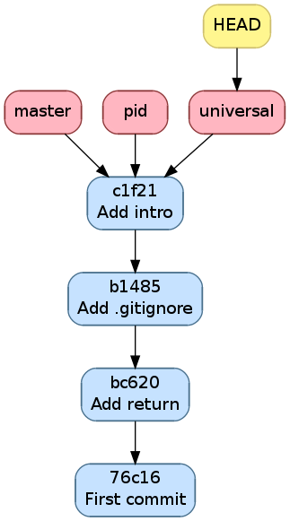

   Historique après avoir mis ``pid`` et ``universal`` à jour

Commençons maintenant à développer notre compatibilité
avec le reste de l'univers.
On va rajouter une option ``--alien`` qui transforme le ``Hello world!``
en ``Hello universe!``

.. code-block:: diff

   $ git diff
   diff --git a/main.c b/main.c
   index 8381ce0..8ccfa11 100644
   --- a/main.c
   +++ b/main.c
   @@ -5,9 +5,14 @@
    // includes
    #include <stdio.h>
    #include <stdlib.h>
   +#include <string.h>

    // main function
   -int main () {
   -  printf("Hello world!\n");
   +int main (int argc, char *argv[]) {
   +  if (strncmp(argv[1], "--alien", 8) == 0) {
   +    printf("Hello universe!\n");
   +  } else {
   +    printf("Hello world!\n");
   +  }
      return EXIT_SUCCESS;
    }

Mettons tous les changements des fichiers traqués avec ``-a``

.. code-block:: bash

   $ git commit -a -m "Make it universal"
   [universal 6c743f6] Make it universal
    1 file changed, 7 insertions(+), 1 deletion(-)

Ce qui donne l'historique suivant

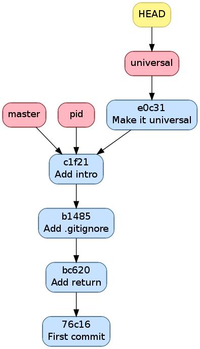

   Historique après avoir committé ``Make it universal``

On va maintenant ajouter un ``Makefile`` qui compile puis exécute le programme
lorsqu'on écrit ``make``.
Comme un ``Makefile`` exécute la première règle, il suffit de mettre la règle
qui exécute en premier

.. code-block:: makefile

   run: a.out
           ./a.out
   a.out: main.c
           gcc main.c

Ainsi, à chaque fois qu'on exécute la commande ``make``, la règle ``run``
sera exécutée mais avant, ses dépendances donc ``a.out`` sera exécutée
si la date de modification de ``main.c``
est plus récente que celle de ``a.out``.
Committons cela

.. code-block:: bash

   $ git checkout master
   Switched to branch 'master'
   $ git status
   # On branch master
   # Untracked files:
   #   (use "git add <file>..." to include in what will be committed)
   #
   #	Makefile
   nothing added to commit but untracked files present (use "git add" to track)
   $ git add Makefile
   $ git commit -m "Add Makefile"
   [master c35a8c3] Add Makefile
    1 file changed, 5 insertions(+)
    create mode 100644 Makefile

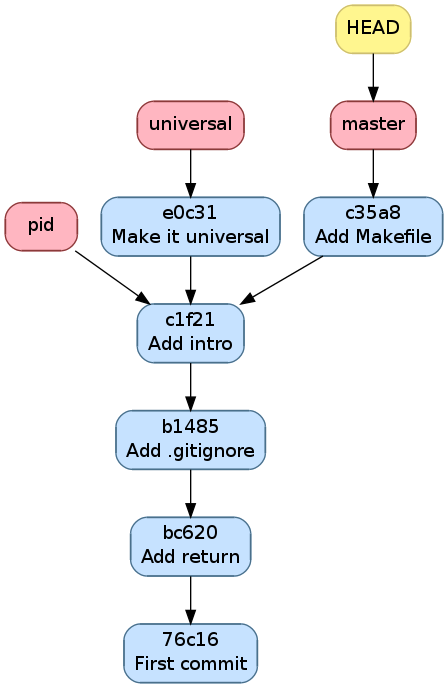

   Historique après avoir committé ``Add Makefile``

On voit ici que pour ``pid``,
fusionner ``master`` est *fast-forward* et pas pour *universal*.
C'est ce qu'on va vérifier

.. code-block:: bash

   $ git checkout universal
   Switched to branch 'universal'
   $ git merge master
   Merge made by the 'recursive' strategy.
    Makefile | 5 +++++
    1 file changed, 5 insertions(+)
    create mode 100644 Makefile

On voit que `Git`_ a su faire la fusion sans notre aide sans problème
car tous les changements étaient dans le ``Makefile`` qui n'existait pas
pour ``universal``

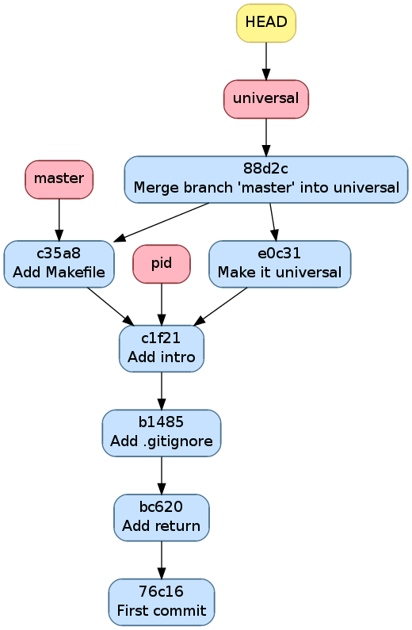

   Historique après avoir fusionné ``master`` dans ``universal``

.. code-block:: bash

   $ git checkout pid
   Switched to branch 'pid'
   $ git merge master
   Updating c1f2163..c35a8c3
   Fast-forward
    Makefile | 5 +++++
    1 file changed, 5 insertions(+)
    create mode 100644 Makefile

`Git`_ nous confirme que c'est *fast-forward*

.. figure:: figures/hello_pid_makefile.png
   :align: center

   Historique après avoir fusionné ``master`` dans ``pid``

Tant qu'on est sur la branche ``pid``,
implémentons la fonctionnalité comme suit

.. code-block:: diff

   $ git diff
   diff --git a/main.c b/main.c
   index 8381ce0..b9043af 100644
   --- a/main.c
   +++ b/main.c
   @@ -5,9 +5,11 @@
    // includes
    #include <stdio.h>
    #include <stdlib.h>
   +#include <unistd.h>

    // main function
    int main () {
   +  printf("pid: %u, ppid: %u\n", getpid(), getppid());
      printf("Hello world!\n");
      return EXIT_SUCCESS;
    }

et committons la

.. code-block:: bash

   $ git commit -a -m "Add pid/ppid info"
   [pid eda36d7] Add pid/ppid info
    1 file changed, 2 insertions(+)

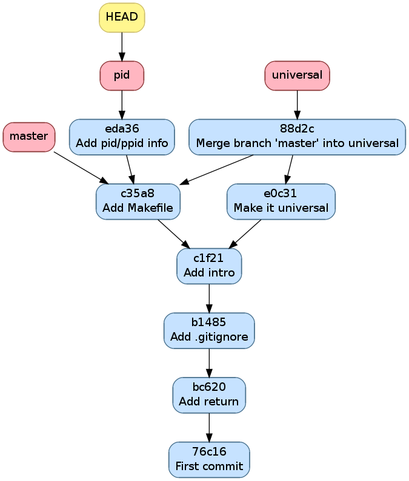

   Historique après avoir implémenté ``pid``

On peut maintenant fusionner ``pid`` dans master et la supprimer car on
en a plus besoin

.. code-block:: bash

   $ git checkout master
   Switched to branch 'master'
   $ git merge pid
   Updating c35a8c3..eda36d7
   Fast-forward
    main.c | 2 ++
    1 file changed, 2 insertions(+)
   $ git branch -d pid
   Deleted branch pid (was eda36d7).

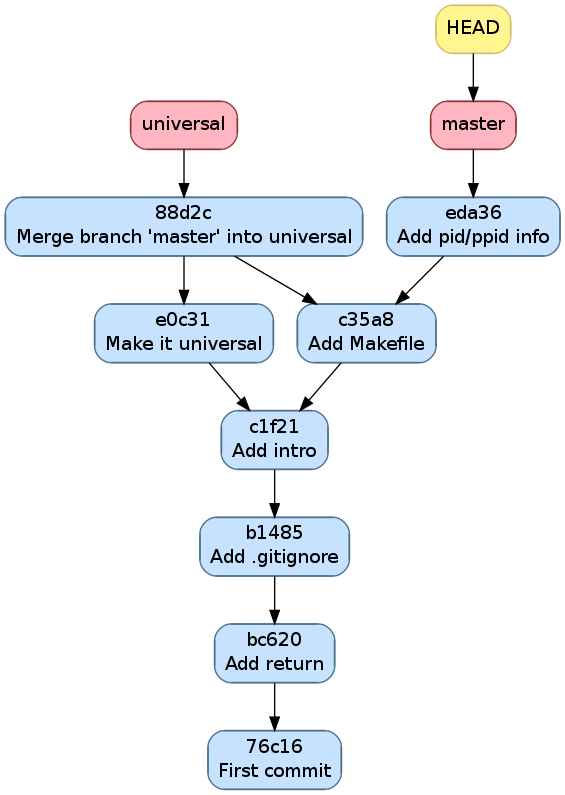

   Historique après avoir fusionné et supprimé ``pid``

Retournons sur notre branche ``universal`` et essayons notre ``Makefile``

.. code-block:: bash

   $ git checkout universal
   Switched to branch 'universal'
   $ make
   gcc main.c
   ./a.out
   make: *** [run] Segmentation fault (core dumped)

Les deux premières lignes sont simplement les commandes que `make(1)`_ exécute.
La troisième est plus inquiètante.
Elle nous avertit que le programme a été terminé par le signal ``SIGSEV``.
C'est dû au fait qu'on ne vérifie pas que ``argv`` ait au moins 2 éléments
avant d'essayer accéder au deuxième élément.

.. code-block:: diff

   $ git diff
   diff --git a/main.c b/main.c
   index 8ccfa11..f90b795 100644
   --- a/main.c
   +++ b/main.c
   @@ -9,7 +9,7 @@

    // main function
    int main (int argc, char *argv[]) {
   -  if (strncmp(argv[1], "--alien", 8) == 0) {
   +  if (argc > 1 && strncmp(argv[1], "--alien", 8) == 0) {
        printf("Hello universe!\n");
      } else {
        printf("Hello world!\n");

Ça marche maintenant sans *Segmentation fault*

.. code-block:: bash

   $ make
   gcc main.c
   $ ./a.out
   Hello world!
   $ ./a.out --alien
   Hello universe!
   $ git commit -a -m "Fix SIGSEV without args"
   [universal 6fd2e9b] Fix SIGSEV without args
    1 file changed, 1 insertion(+), 1 deletion(-)

.. figure:: figures/hello_fix.png
   :align: center

   Historique après avoir réparé le ``Segmentation fault``

``universal`` est maintenant prêt à être mergée.

.. code-block:: bash

   $ git checkout master
   Switched to branch 'master'
   $ git merge universal
   Auto-merging main.c
   CONFLICT (content): Merge conflict in main.c
   Automatic merge failed; fix conflicts and then commit the result.

Les conflits sont marqués dans ``main.c``

.. code-block:: c

   /*
    * Print 'Hello world!'
    */

   // includes
   #include <stdio.h>
   #include <stdlib.h>
   <<<<<<< HEAD
   #include <unistd.h>

   // main function
   int main () {
     printf("pid: %u, ppid: %u\n", getpid(), getppid());
     printf("Hello world!\n");
   =======
   #include <string.h>

   // main function
   int main (int argc, char *argv[]) {
     if (argc > 1 && strncmp(argv[1], "--alien", 8) == 0) {
       printf("Hello universe!\n");
     } else {
       printf("Hello world!\n");
     }
   >>>>>>> universal
     return EXIT_SUCCESS;
   }

Il nous faut maintenant éditer ``main.c`` pour résoudre le conflit.
Il n'y a un conflit à un seul endroit du fichier mais le conflit est assez
large, `Git`_ nous montre ce qu'il y a pour ``HEAD`` c'est à dire
la branche active ``master`` et ce qu'il y a pour ``universal``.
On va devoir prendre un peu des deux.

Si on fait `git-diff(1)`_ par la suite, `Git`_ met en début de ligne un
``+`` ou un ``-`` en premier caractère
si c'est une ligne qui vient de la branche qu'on veut fusionner,
en deuxième caractère si ça vient de la branche active et en premier et
deuxième caractère si ça vient d'aucune des deux pour le ``+``.

.. code-block:: diff

   $ git diff
   diff --cc main.c
   index b9043af,f90b795..0000000
   --- a/main.c
   +++ b/main.c
   @@@ -5,11 -5,14 +5,17 @@@
     // includes
     #include <stdio.h>
     #include <stdlib.h>
    +#include <unistd.h>
   + #include <string.h>

     // main function
   - int main () {
   + int main (int argc, char *argv[]) {
    +  printf("pid: %u, ppid: %u\n", getpid(), getppid());
   -   printf("Hello world!\n");
   ++
   +   if (argc > 1 && strncmp(argv[1], "--alien", 8) == 0) {
   +     printf("Hello universe!\n");
   +   } else {
   +     printf("Hello world!\n");
   +   }
       return EXIT_SUCCESS;
     }

Il n'y a pas besoin de spécifier de commentaire pour une fusion car
`Git`_ en génère un automatiquement

.. code-block:: bash

   $ git commit -a
   [master 0dd6cd7] Merge branch 'universal'

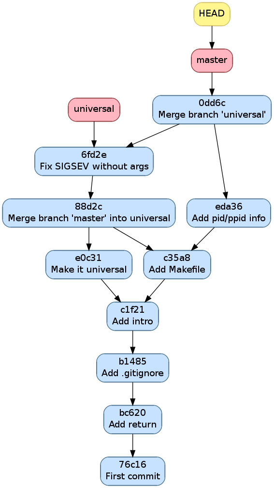

   Historique après avoir fusionné la branche ``universal``

On voit que la branche ``universal`` est restée à sa place car ce n'était
pas la branche active.
On peut d'ailleurs maintenant la supprimer

.. code-block:: bash

   $ git branch -d
   Deleted branch universal (was 6fd2e9b).

Autres commandes utiles
~~~~~~~~~~~~~~~~~~~~~~~

Afficher l'historique
#####################

Pour afficher l'historique, outre l'outil utilisé pour faire les
illustrations de ce cours que vous pouvez retrouver
`https://github.com/blegat/git-dot <https://github.com/blegat/git-dot>`_,
il existe la commande `git-log(1)`_.
Elle est très flexible comme on va le voir.
``git log`` affiche simplement l'historique à partir de ``HEAD``

.. code-block:: bash

   $ git log
   commit 0dd6cd7e6ecf01b638cd631697bf9690baedcf20
   Merge: eda36d7 6fd2e9b
   Author: Benoît Legat <benoit.legat@gmail.com>
   Date:   Sun Aug 18 15:29:53 2013 +0200

       Merge branch 'universal'

       Conflicts:
           main.c

   commit 6fd2e9bfa199fc3dbca4df87d225e35553d6cd79
   Author: Benoît Legat <benoit.legat@gmail.com>
   Date:   Sun Aug 18 15:06:14 2013 +0200

       Fix SIGSEV without args

   commit eda36d79fd48561dce781328290d40990e74a758
   Author: Benoît Legat <benoit.legat@gmail.com>
   Date:   Sun Aug 18 14:58:29 2013 +0200

       Add pid/ppid info

   ...

Mais on peut aussi demander d'afficher les modifications pour chaque commit
avec l'option ``-p``

.. code-block:: diff

   $ git log -p
   commit 0dd6cd7e6ecf01b638cd631697bf9690baedcf20
   Merge: eda36d7 6fd2e9b
   Author: Benoît Legat <benoit.legat@gmail.com>
   Date:   Sun Aug 18 15:29:53 2013 +0200

       Merge branch 'universal'

       Conflicts:
           main.c

   commit 6fd2e9bfa199fc3dbca4df87d225e35553d6cd79
   Author: Benoît Legat <benoit.legat@gmail.com>
   Date:   Sun Aug 18 15:06:14 2013 +0200

       Fix SIGSEV without args

   diff --git a/main.c b/main.c
   index 8ccfa11..f90b795 100644
   --- a/main.c
   +++ b/main.c
   @@ -9,7 +9,7 @@

    // main function
    int main (int argc, char *argv[]) {

    // main function
    int main (int argc, char *argv[]) {
   -  if (strncmp(argv[1], "--alien", 8) == 0) {
   +  if (argc > 1 && strncmp(argv[1], "--alien", 8) == 0) {
        printf("Hello universe!\n");
      } else {
        printf("Hello world!\n");

   commit eda36d79fd48561dce781328290d40990e74a758
   Author: Benoît Legat <benoit.legat@gmail.com>
   Date:   Sun Aug 18 14:58:29 2013 +0200

       Add pid/ppid info

   diff --git a/main.c b/main.c
   index 8381ce0..b9043af 100644
   --- a/main.c
   +++ b/main.c
   @@ -5,9 +5,11 @@
    // includes
    #include <stdio.h>
    #include <stdlib.h>
   +#include <unistd.h>

    // main function
    int main () {
   +  printf("pid: %u, ppid: %u\n", getpid(), getppid());
      printf("Hello world!\n");
      return EXIT_SUCCESS;
    }

Il existe encore plein d'autres options comme ``--stat`` qui se contente
de lister les fichiers qui ont changés.
En les combinant on peut obtenir des résultats intéressants comme ci-dessous

.. code-block:: bash

   $ git log  --graph --decorate --oneline
   *   0dd6cd7 (HEAD, master) Merge branch 'universal'
   |\
   | * 6fd2e9b Fix SIGSEV without args
   | *   88d2c61 Merge branch 'master' into universal
   | |\
   | * | e0c317a Make it universal
   * | | eda36d7 Add pid/ppid info
   | |/
   |/|
   * | c35a8c3 Add Makefile
   |/
   * c1f2163 Add intro
   * b14855e Add .gitignore
   * bc620ce Add return
   * 76c1677 First commit

On ajoute d'ailleurs souvent un raccourci pour avoir ce graphe avec
``git lol``.

.. code-block:: bash

   $ git config --global alias.lol "log --graph --decorate --oneline"

.. TODO comparer différents commits

Sauvegarder des modifications hors de l'historique
##################################################

On a vu que certaines opérations comme `git-checkout(1)`_ nécessitent
de ne pas avoir de modifications en conflit avec l'opération.

`git-stash(1)`_ permet de sauvegarder ces modifications pour qu'elles ne soient
plus dans le *working directory* mais qu'elles ne soient pas perdues.
On peut ensuite les réappliquer avec ``git stash apply`` puis les effacer
avec ``git stash drop``.

Reprenons notre exemple de *Changer la branche active* illustré par la figure
suivante

   Historique après avoir ajouté un commentaire d'introduction

.. code-block:: bash

   $ git checkout pid
   Switched to branch 'pid'
   $ echo "42" >> main.c
   $ echo "42" >> .gitignore
   $ git stash
   Saved working directory and index state WIP on pid: b14855e Add .gitignore
   HEAD is now at b14855e Add .gitignore
   $ git checkout master
   Switched to branch 'master'
   $ git stash apply
   Auto-merging main.c
   # On branch master
   # Changes not staged for commit:
   #   (use "git add <file>..." to update what will be committed)
   #   (use "git checkout -- <file>..." to discard changes in working directory)
   #
   #	modified:   .gitignore
   #	modified:   main.c
   #
   no changes added to commit (use "git add" and/or "git commit -a")

On voit que les changements on été appliqués

.. code-block:: diff

   $ git diff
   diff --git a/.gitignore b/.gitignore
   index cba7efc..5df1452 100644
   --- a/.gitignore
   +++ b/.gitignore
   @@ -1 +1,2 @@
    a.out
   +42
   diff --git a/main.c b/main.c
   index 8381ce0..eefabd7 100644
   --- a/main.c
   +++ b/main.c
   @@ -11,3 +11,4 @@ int main () {
      printf("Hello world!\n");
      return EXIT_SUCCESS;
    }
   +42

On peut alors supprimer le *stash*

.. code-block:: bash

   $ git stash drop
   Dropped refs/stash@{0} (ae5b4fdeb8bd751449d73f955f7727f660708225)

Modifier un commit récent
#########################

Si on a oublié d'ajouter des modifications dans le dernier commit et
qu'on ne l'a pas encore *pushé*, on peut facilement les rajouter.
Il suffit de donner l'option ``--amend`` à `git-commit(1)`_.
Il ajoutera alors les modifications au commit actuel au lieu d'en créer un
nouveau.

On peut aussi annuler le dernier commit avec ``git reset HEAD^``.
`Git`_ permet aussi de construire un commit qui a l'effet inverse d'un autre
avec `git-revert(1)`_.
Ce dernier construit un commit qui annulera l'effet d'un autre commit.
Voyons tout ça par un exemple qui pourrait être le code de *Deep Thought*.

On a un fichier ``main.c`` contenant

.. code-block:: c

   #include <stdio.h>
   #include <stdlib.h>

   int main (int argc, char *argv[]) {
     int *n = (int*) malloc(sizeof(int));
     *n = 42;
     printf("%d\n", *n);
     return EXIT_SUCCESS;
   }

un ``Makefile`` contenant

.. code-block:: makefile

   run: answer
       echo "The answer is `./answer`"

   answer: main.c
       gcc -o answer main.c

si bien qu'on a

.. code-block:: bash

   $ make
   gcc -o answer main.c
   echo "The answer is `./answer`"
   The answer is 42
   $ make
   echo "The answer is `./answer`"
   The answer is 42
   $ touch main.c
   $ make
   gcc -o answer main.c
   echo "The answer is `./answer`"
   The answer is 42

et un fichier ``.gitignore`` avec comme seul ligne ``answer``.

Commençons par committer ``main.c`` et ``.gitignore`` en oubliant le
``Makefile``.

.. code-block:: bash

   $ git init
   Initialized empty Git repository in /path/to_project/.git/
   $ git status
   # On branch master
   #
   # Initial commit
   #
   # Untracked files:
   #   (use "git add <file>..." to include in what will be committed)
   #
   #	.gitignore
   #	Makefile
   #	main.c
   nothing added to commit but untracked files present (use "git add" to track)
   $ git add .gitignore main.c
   $ git commit -m "First commit"
   [master (root-commit) 54e48c9] First commit
    2 files changed, 10 insertions(+)
    create mode 100644 .gitignore
    create mode 100644 main.c
   $ git log --stat --oneline
   54e48c9 First commit
    .gitignore | 1 +
    main.c     | 9 +++++++++
    2 files changed, 10 insertions(+)
   $ git status
   # On branch master
   # Untracked files:
   #   (use "git add <file>..." to include in what will be committed)
   #
   #	Makefile
   nothing added to commit but untracked files present (use "git add" to track)

On pourrait très bien faire un nouveau commit contenant le ``Makefile``
mais si, pour une quelconque raison,
on aimerait l'ajouter dans le commit précédent,
on peut le faire comme suit

.. code-block:: bash

   $ git add Makefile
   $ git commit --amend
   [master 1712853] First commit
    3 files changed, 15 insertions(+)
    create mode 100644 .gitignore
    create mode 100644 Makefile
    create mode 100644 main.c
   $ git log --stat --oneline
   1712853 First commit
    .gitignore | 1 +
    Makefile   | 5 +++++
    main.c     | 9 +++++++++
    3 files changed, 15 insertions(+)

On voit qu'aucun commit n'a été créé mais c'est le commit précédent qui
a été modifié.
Ajoutons maintenant un check de la valeur retournée par `malloc(3)`_ pour gérer
les cas limites

.. code-block:: diff

   $ git diff
   diff --git a/main.c b/main.c
   index 39d64ac..4864e60 100644
   --- a/main.c
   +++ b/main.c
   @@ -3,6 +3,10 @@

    int main (int argc, char *argv[]) {
      int *n = (int*) malloc(sizeof(int));
   +  if (*n == NULL) {
   +    perror("malloc");
   +    return EXIT_FAILURE;
   +  }
      *n = 42;
      printf("%d\n", *n);
      return EXIT_SUCCESS;

et committons le

.. code-block:: bash

   $ git add main.c
   $ git commit -m "Check malloc output"
   [master 9e45e79] Check malloc output
    1 file changed, 4 insertions(+)
   $ git log --stat --oneline
   9e45e79 Check malloc output
    main.c | 4 ++++
    1 file changed, 4 insertions(+)
   1712853 First commit
    .gitignore | 1 +
    Makefile   | 5 +++++
    main.c     | 9 +++++++++
    3 files changed, 15 insertions(+)

Essayons maintenant de construire un commit qui retire les lignes qu'on
vient d'ajouter avec `git-revert(1)`_

.. code-block:: bash

   $ git revert 9e45e79
   [master 6c0f33e] Revert "Check malloc output"
    1 file changed, 4 deletions(-)
   $ git log --stat --oneline
   6c0f33e Revert "Check malloc output"
    main.c | 4 ----
    1 file changed, 4 deletions(-)
   9e45e79 Check malloc output
    main.c | 4 ++++
    1 file changed, 4 insertions(+)
   1712853 First commit
    .gitignore | 1 +
    Makefile   | 5 +++++
    main.c     | 9 +++++++++
    3 files changed, 15 insertions(+)

Le contenu de ``main.c`` est alors

.. code-block:: c

   #include <stdio.h>
   #include <stdlib.h>

   int main (int argc, char *argv[]) {
     int *n = (int*) malloc(sizeof(int));
     *n = 42;
     printf("%d\n", *n);
     return EXIT_SUCCESS;
   }

Comme c'est une bonne pratique de vérifier la valeur de retour de `malloc(3)`_,
supprimons ce dernier commit

.. code-block:: bash

   $ git reset HEAD^
   Unstaged changes after reset:
   M	main.c
   $ git log --oneline
   9e45e79 Check malloc output
   1712853 First commit

Corriger des bugs grâce à Git
~~~~~~~~~~~~~~~~~~~~~~~~~~~~~

Git permet de garder des traces des nombreux changements qui ont été effectué au
cours de l’évolution d’un programme. Il contient d’ailleurs un outil très
puissant vous permettant de retrouver la source de certaines erreurs, pourvu que
les changements soient faits par petits commits : `git-bisect(1)`_.

Supposez que vous ayez introduit une fonctionnalité dans votre programme. Tout
allait alors pour le mieux. Quelques semaines plus tard, à votre grand dam, vous
vous rendez compte qu’elle ne fonctionne plus. Vous sillonnez tous les fichiers
qui pourraient interagir avec cette fonction, en vain. Dans le désespoir, à
l’approche de la deadline, vous succombez au nihilisme.

Avant de tout abandonner, pourtant, vous réalisez quelque chose de très
important. Ce que vous cherchez, c’est la source de l’erreur ; cela fait, la
corriger sera sans l’ombre d’un doute une tâche aisée. Si seulement il était
possible de voir à partir de quel changement le bug a été introduit…

C’est là que vous repensez à Git ! Git connaît tous les changements qui ont été
effectués, et vous permet facilement de revenir dans le passé pour vérifier si
le bug était présent à un moment donné. En outre, vous vous rappelez vos cours
d’algorithmiques et vous rendez compte que, puisque vous connaissez un point où
le bug était présent et un autre ou il ne l’était pas, vous pouvez à l’aide
d’une recherche binaire déterminer en un temps logarithmique (par rapport aux
nombres de révisions comprises dans l’intervalle) quelle révision a introduit
l’erreur.

C’est exactement l’idée derrière `git-bisect(1)` : vous donnez un intervalle de
commits dans lequel vous êtes certains de pouvoir trouver le vilain commit
responsable de tous vos maux, pour ensuite le corriger. Vous pouvez même
entièrement automatiser cette tâche si vous pouvez, excellent programmeur que
vous êtes, écrire un script qui renvoie 1 si le bug est présent et 0 si tout va
bien.

Pour vous montrez comme utiliser cette fonctionnalité, et vous convaincre que
cela marche vraiment, et pas seulement dans des exemples fabriqués uniquement
dans un but de démonstration, nous allons l’appliquer à un vrai programme C :
mruby, une implémentation d’un langage correspondant à un sous-ensemble de Ruby.

Intéressons nous à `un des problèmes qui a été rapporté par un utilisateur
<https://github.com/mruby/mruby/issues/1583>`_. Si vous lisez cette page, vous
verrez qu’en plus de décrire le problème, il mentionne le commit à partir duquel
il rencontre l’erreur. Si vous regardez aussi le commit qui l’a corrigée, vous
verrez que le développeur a bien dû changer une ligne introduite dans le commit
qui avait été accusé par l’utilisateur.

Mettons nous dans la peau de l’utilisateur qui a trouvé le bug, et tentons nous
aussi d’en trouver la cause, en utilisant Git. D’abord, il nous faut obtenir le
dépôt sur notre machine (vous aurez besoin de Ruby afin de pouvoir tester),
et revenir dans le passé puisque, depuis, l’erreur a été corrigée.

        .. code-block:: console

                $ git clone git@github.com:mruby/mruby.git
                (...)
                $ cd mruby
                $ git checkout 5b51b119ca16fe42d63896da8395a5d05bfa9877~1
                (...)

Sauvegardons aussi le fichier de test proposé, par exemple dans
``~/code/rb/test.rb`` :

        .. code-block:: ruby

                class A
                  def a
                    b
                  end
                  def b
                    c
                  end
                  def c
                    d
                  end
                end
                x = A.new.a

Vous devriez maintenant être capable de vérifier que la méthode ``A.a`` n’est pas
incluse dans la backtrace :

        .. code-block:: console

                $ make && ./bin/mruby ~/code/rb/test.rb
                (...)
                trace:
                        [3] /home/kilian/code/rb/test.rb:9:in A.c
                        [2] /home/kilian/code/rb/test.rb:6:in A.b
                        [0] /home/kilian/code/rb/test.rb:13
                /home/kilian/code/rb/test.rb:9: undefined method 'd' for #<A:0xdf1000> (NoMethodError)

C’est le moment de commencer. Il faut d’abord dire à Git que nous désirons
démarrer une bissection et que le commit actuel est « mauvais », c’est à dire
que le bug est présent. Ceci est fait en utilisant les deux lignes suivantes,
dans l’ordre :

        .. code-block:: console

                $ git bisect start
                $ git bisect bad

Regardons ce qu’il en était quelque mois auparavant (remarquez qu’il faut
utiliser ``make clean`` pour s’assurer de tout recompiler ici) :

        .. code-block:: console

                $ git checkout 3a27e9189aba3336a563f1d29d95ab53a034a6f5
                Previous HEAD position was 7ca2763... write_debug_record should dump info recursively; close #1581
                HEAD is now at 3a27e91... move (void) cast after declarations
                $ make clean && make && ./bin/mruby ~/code/test.rb
                (...)
                trace:
                        [3] /home/kilian/code/rb/test.rb:9:in A.c
                        [2] /home/kilian/code/rb/test.rb:6:in A.b
                        [1] /home/kilian/code/rb/test.rb:3:in A.a
                        [0] /home/kilian/code/rb/test.rb:13
                /home/kilian/code/rb/test.rb:9: undefined method 'd' for #<A:0x165d2c0> (NoMethodError)

Cette fois-ci, tout va bien. Nous pouvons donc en informer Git :

        .. code-block:: console

                $ git bisect good
                Bisecting: 116 revisions left to test after this (roughly 7 steps)
                [fe1f121640fbe94ad2e7fabf0b9cb8fdd4ae0e02] Merge pull request #1512 from wasabiz/eliminate-mrb-intern

Ici, Git nous dit combien de révisions il reste à vérifier dans l’intervalle en
plus de nous donner une estimation du nombre d’étapes que cela prendra. Il nous
informe aussi de la révision vers laquelle il nous a déplacé. Nous pouvons donc
réitérer notre test et en communiquer le résultat à Git :

        .. code-block:: console

                $ make clean && make && ./bin/mruby ~/code/test.rb
                (...)
                trace:
                        [3] /home/kilian/code/rb/test.rb:9:in A.c
                        [2] /home/kilian/code/rb/test.rb:6:in A.b
                        [1] /home/kilian/code/rb/test.rb:3:in A.a
                        [0] /home/kilian/code/rb/test.rb:13
                /home/kilian/code/rb/test.rb:9: undefined method 'd' for #<A:0x165d2c0> (NoMethodError)
                $ git bisect good
                Bisecting: 58 revisions left to test after this (roughly 6 steps)
                [af03812877c914de787e70735eb89084434b21f1] add mrb_ary_modify(mrb,a); you have to ensure mrb_value a to be an array; ref #1554

Si nous réessayons, nous allons nous rendre compte que notre teste échoue à
présent (il manque la ligne ``[1]``): nous somme allés trop loin dans le
futur. Il nous faudra donc dire à Git que la révision est mauvaise.

        .. code-block:: console

                $ make clean && make && ./bin/mruby ~/code/test.rb
                (...)
                trace:
                        [3] /home/kilian/code/rb/test.rb:9:in A.c
                        [2] /home/kilian/code/rb/test.rb:6:in A.b
                        [0] /home/kilian/code/rb/test.rb:13
                /home/kilian/code/rb/test.rb:9: undefined method 'd' for #<A:0x165d2c0> (NoMethodError)
                $ git bisect bad
                Bisecting: 28 revisions left to test after this (roughly 5 steps)
                [9b2f4c4423ed11f12d6393ae1f0dd4fe3e51ffa0] move declarations to the beginning of blocks

Si vous continuez à appliquer cette procédure, vous allez finir par trouver la
révision fautive, et Git nous donnera l’information que nous recherchions, comme
par magie :

        .. code-block:: console

                $ git bisect bad
                Bisecting: 0 revisions left to test after this (roughly 0 steps)
                [a7c9a71684fccf8121f16803f8e3d758f0dea001] better error position display
                $ make clean && make && ./bin/mruby ~/code/rb/test.rb
                (...)
                trace:
                        [3] /home/kilian/code/rb/test.rb:9:in A.c
                        [2] /home/kilian/code/rb/test.rb:6:in A.b
                        [0] /home/kilian/code/rb/test.rb:13
                /home/kilian/code/rb/test.rb:9: undefined method 'd' for #<A:0x1088160> (NoMethodError)
                $ git bisect bad
                a7c9a71684fccf8121f16803f8e3d758f0dea001 is the first bad commit
                commit a7c9a71684fccf8121f16803f8e3d758f0dea001
                Author: Yukihiro "Matz" Matsumoto <matz@ruby-lang.org>
                Date:   Tue Oct 15 12:49:41 2013 +0900

                    better error position display

                :040000 040000 67b00e2d4f6acadc0474e00fc0f5e6e13673c64a 036eb9c3b9960613bde3882b7a88ac6cabc56253 M      include
                :040000 040000 5040dd346fea4d8f476d26ad2ede0dc49ca368cd 903f2d954d8686e7bfa7bcf5d83b80b5beb4899f M      src

Maintenant que nous connaissons la source du problème, il ne faut pas oublier de
confirmer à Git que la recherche est bien terminée, et que nous désirons
remettre le dépôt dans son état normal.

        .. code-block:: console

                $ git bisect reset
                Previous HEAD position was a7c9a71... better error position display
                HEAD is now at 7ca2763... write_debug_record should dump info
                recursively; close #1581

Automatisation de la procédure
##############################

Exécuter ce test à la main est cependant répétitif, prône aux erreurs
d’inattention, et surtout très facile à automatiser. Écrivons donc un script qui
vérifie que la ligne mentionnant ``A.a`` est bien présente à chaque fois,
appelons le par exemple ``~/code/sh/Iznogoud.sh``. Il s’agit de renvoyer 0
si tout se passe bien et une autre valeur s’il y a un problème.

        .. code-block:: bash

                #!/usr/bin/env bash
                make clean && make && ./bin/mruby ~/code/rb/test.rb 2>&1 | grep A\.a

Puisque ``grep`` renvoie 1 quand il ne trouve pas de ligne contenant le motif
qu’on lui passe en argument et 0 sinon, notre script renvoie bien 1 si la sortie
de mruby ne contient pas la ligne mentionnant ``A.a`` et 0 sinon.

N’oubliez pas de changer les permissions du script pour en permettre l’exécution :

        .. code-block:: console

                $ chmod +x ~/code/sh/Iznogoud.sh

Ce test n’est en bien sûr pas infaillible, mais sera suffisant ici. Il faut
d’abord redonner à Git l’intervalle dans lequel se trouve la révision fautive.

        .. code-block:: console

                $ git bisect start
                $ git bisect bad
                $ git checkout 3a27e9189aba3336a563f1d29d95ab53a034a6f5
                Previous HEAD position was 7ca2763... write_debug_record should dump info recursively; close #1581
                HEAD is now at 3a27e91... move (void) cast after declarations
                $ git bisect good
                Bisecting: 116 revisions left to test after this (roughly 7 steps)
                [fe1f121640fbe94ad2e7fabf0b9cb8fdd4ae0e02] Merge pull request #1512 from wasabiz/eliminate-mrb-intern

Il suffit maintenant d’utiliser ``git bisect run`` avec le nom du script pour
l’utiliser. Il est possible de rajouter d’autres arguments après le nom du
script, qui seront passés au script lors de chaque exécution. Par exemple, si
vous avez dans votre Makefile une tâche test qui renvoie 0 si tous les tests
passent et 1 si certains échouent, alors ``git bisect run make test``
permettrait de trouver à partir de quand les tests ont cessé de fonctionner.

Si vous exécutez la ligne suivante, vous devriez bien trouver, après quelques
compilations, le même résultat qu’avant :

        .. code-block:: console

                $ git bisect run ~/code/sh/Iznogoud.sh
                (...)
                a7c9a71684fccf8121f16803f8e3d758f0dea001 is the first bad commit
                commit a7c9a71684fccf8121f16803f8e3d758f0dea001
                Author: Yukihiro "Matz" Matsumoto <matz@ruby-lang.org>
                Date:   Tue Oct 15 12:49:41 2013 +0900

                    better error position display

                :040000 040000 67b00e2d4f6acadc0474e00fc0f5e6e13673c64a 036eb9c3b9960613bde3882b7a88ac6cabc56253 M      include
                :040000 040000 5040dd346fea4d8f476d26ad2ede0dc49ca368cd 903f2d954d8686e7bfa7bcf5d83b80b5beb4899f M      src
                bisect run success

À nouveau, n’oubliez pas d’utiliser ``git bisect reset`` avant de continuer à
travailler sur le dépôt.

Subversion
----------

`subversion`_ (ou abrégé `svn(1)`_) est un logiciel qui permet à plusieurs utilisateurs de travailler sur les mêmes documents de type texte. `Subversion`_ est fréquemment utilisé pour gérer du code source développé de façon collaborative, mais il peut aussi servir à gérer n'importe quel ensemble de fichiers (de préférence textes) manipulés par plusieurs personnes.

.. Dans le cadre du cours SINF1252 vous devez vous inscrire à subversion dans le projet ``SINF1252_2012`` en suivant le lien et les instructions sur http://wiki.student.info.ucl.ac.be/index.php/Svn

Pour commencer l'utilisation de `svn(1)`_ vous devriez faire d'abord un ``checkout`` du répertoire:

        .. code-block:: console

                $ svn checkout <url de votre répertoire>
                Checked out revision 1.

Ceci installe votre répertoire (ici, nommé ``my_rep``) dans le dossier courant. Vous pouvez vous déplacer dans le nouveau dossier et créer un nouveau dossier pour cet premier projet. Il faut explicitement ajouter ce dossier à svn avec la commande ``svn add [nom du dossier]``. Chaque fichier et dossier dont vous voulez qu'il fasse partie du contrôle de version doivent être ajoutés avec cette commande.

        .. code-block:: console

                $ cd my_rep
                $ mkdir projet_S1
                $ svn add projet_S1
                A       projet_S1

Ce dossier n'a pas encore été envoyé sur le serveur principal et n'est donc pas encore visible pour d'autres utilisateurs. Pour afficher l'état de votre répertoire utilisez ``svn status``. La lettre ``A`` indique que ceci est un nouveau dossier/fichier pas encore envoyé vers le serveur. ``?`` indique que les fichiers/dossiers ne font pas partie du répertoire svn (on peut les ajouter avec ``svn add``). ``M`` indique que les fichiers sont modifiés localement mais pas encore envoyés vers le serveur. Ces fichiers font partie du répertoire svn.

        .. code-block:: console

                $ svn status
                A       projet_S1
                $ svn commit -m "Projet S1: Initialisation"
                Adding  projet_S1
                Transmitting file data .
                Committed revision 2.

La commande ``svn commit`` permet de pousser les changements locaux et les nouveaux fichiers vers le serveur. La chaîne de charactères entre les ``"`` est le commentaire qu'il faut ajouter au commit. Il est important de commenter vos commits pour que vous puissiez vous retrouvez dans votre historique. L'historique de votre répertoire peut être affiché avec la commande ``svn log``.

Les autres utilisateurs de votre répertoire (c'est-à-dire dans le cadre de ce cours: vôtre binôme du groupe) peuvent à partir de maintenant accéder à ce nouveau dossier en mettant à jour son répertoire local.
Pour mettre à jour le répertoire local, on utilise la commande ``svn update``.

        .. code-block:: console

                $ svn update
                Updating '.':
                A       projet_S1
                Updated to revision 2.

Il est recommandé de toujours faire un ``update`` avant de faire un ``commit``. Lors d'un update il est possible qu'un conflit se crée dans votre dossier local. Ceci peut arriver si vous avez modifié une ligne dans un fichier localement et que cette ligne a aussi été modifiée par le commit d'un autre utilisateur. Pour résoudre le conflit, vous devez éditer le fichier que svn a indiqué être en conflit en cherchant des lignes qui commencent par ``<<<``. Corrigez ce fichier et retournez dans la console et tapez ``r`` pour indiquer à svn que ce conflit a été résolu.

Pour plus d'informations sur svn regardez les commandes ``svn help``, ``svn help [commande]`` ou http://svnbook.red-bean.com/. Une recherche sur Google vous aidera aussi pour résoudre vos problèmes avec subversion.
